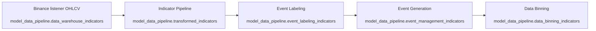

### Perps Trading Pipelines — Developer Guide

This guide explains the four batch pipelines that build the trading dataset and event signals:

- Indicator Pipeline
- Event Labeling
- Event Generation
- Data Binning

It covers the business logic, core calculations, data contracts (BigQuery schemas), and how everything runs on GCP via Cloud Run Jobs and Cloud Scheduler.



## Shared concepts

- Bar size: 15s bars by default (`BAR_SECONDS = 15`) for time math and window lengths.
- Idempotency: Each job is designed to process only new slices since last success, using MAX timestamp cursors in its destination table where applicable.
- GCP data store: BigQuery is the system of record for all intermediate and final outputs.
- Scheduling: Each pipeline is deployed as a Cloud Run Job and triggered on a schedule with Cloud Scheduler (typical rate: every minute).

---

### 1) Indicator Pipeline

Purpose: Transform raw OHLCV into a rich indicator snapshot per bar, including base indicators, derivatives, and rolling z-scores. Also writes a companion “crossings” feed for zero-line/threshold crosses.

- Entrypoint: `indicator-pipeline/main.py`
- Core engine: `indicator-pipeline/processors/realtime_processor.py`
- Indicator math: `indicator-pipeline/indicators/*.py`
- BigQuery I/O: `indicator-pipeline/processors/bigquery_handler.py`
- Cross detection: `indicator-pipeline/processors/crossing_detector.py`
- Config: `indicator-pipeline/config.py`
- Destination table: `model_data_pipeline.transformed_indicators`
- Crossings table: `model_data_pipeline.crossing_Indicators`

Inputs (from `data_warehouse_indicators`):
- `timestamp`, `symbol`, `open`, `high`, `low`, `close`, `volume`

Outputs (per bar):
- `Raw_Values`: nested STRUCT of base indicators and their derivatives/vols
- `Z_Score_Alpha_Values`: nested STRUCT of short-window z-scores
- `Z_Score_Beta_Values`: nested STRUCT of long-window z-scores
- Metadata: `open_time` (ISO timestamp), `symbol`

Indicator set (high level):
- MACD family
  - MACD line = EMA_fast(close) − EMA_slow(close)
  - Signal line = EMA(MACD, signal)
  - Histogram = MACD − Signal
- Log Returns Rate of Change (LRROC)
  - lrroc_t = ln((close_t + ε)/(close_{t−n} + ε)) × 100; `n = LRROC_PERIOD`
- Long EMA: EMA_slow(close)
- OBV family
  - OBV: cumulative sum of sign(diff(close)) × volume
  - OBV oscillator variants: `OBV_OSC = OBV − EMA(OBV, length)`, Wilder/RMA-smoothed, SMA-smoothed, scaled
- Momentum: TSI (double EMA of change and abs(change))
- RSI (Wilder’s method with explicit SMA smoothing over the same period), plus `RSI_Spot`
- Volatility: ATR (Wilder), SVF (Scalper Volatility Filter) composed of modified Damiani, ADX-based signal, and dispersion; normalized and averaged
- Trend: ADX (Wilder RMA of DX), Price/OBV regime EMAs (fast/slow) and their histogram heights
- Entropy: negative log of rolling standard deviation (short vs long reference; histogram = difference)
- Fusion Oscillator: normalized blend of RSI, smoothed MACD, and smoothed OBV oscillator

Derivatives and volatility normalization (`indicators/derivatives.py`):
- First derivative: backward difference Δx
- Second derivative: three-point backward difference
- ATR-normalized volatility for base and derivative series: Y_t = X_t / ATR_t

Rolling z-scores (`indicators/normalization.py`):
- Zscore_Alpha_*, Zscore_Beta_*, Zscore_Gamma_*, Zscore_Delta_* using rolling mean and population std (ddof=0) per configured windows

Crossing detection (`processors/crossing_detector.py` → `crossing_Indicators` table):
- Zero-line crosses for: `LRROC`, `OBV_OSC`, `TSI`, `Fusion_Oscillator`, and histogram heights for price/OBV regime
- SVF high/low crosses vs 0 baseline
- Entropy high/low uncertainty vs its SMA (reference)
- ADX below-20 condition (low-trend)
- RSI crosses 50, and reversion crosses from 70/30

BigQuery shape: see `schema/tranfromed_indicator.sql` and `schema/crossing_indicator.sql` for full nested STRUCT field lists and types.

Run mode:
- Batch (Cloud Run Job): processes available new rows and exits.

GCP deployment:
- Build image and deploy a Cloud Run Job using `indicator-pipeline/job.yaml` or `indicator-pipeline/deploy.sh`.
- Service account requires BigQuery read/write to the source/destination tables.

Scheduling:
- Use Cloud Scheduler to trigger the job every minute (or as needed). The pipeline reads from the last `open_time` in the destination table to continue.

---

### 2) Event Labeling

Purpose: Compute discrete event-related labels for each bar based on MACD and LazyBear “Impulse MACD,” and mark period boundaries for observation, lookback, long-entry, and event windows.

- Entrypoint: `event_labeling/main.py` (one-shot by default; `--continuous` optional)
- Generator: `event_labeling/event_labeling/generator.py`
- Label logic: `event_labeling/event_labeling/event_labeling.py`
- Indicator helpers: `event_labeling/event_labeling/macd.py`, `event_labeling/event_labeling/lazy_bear.py`
- BigQuery I/O: `event_labeling/processors/bigquery_handler.py`
- Config: `event_labeling/config.py`
- Destination table: `model_data_pipeline.event_labeling_indicators`

Inputs (from `data_warehouse_indicators`):
- OHLCV per bar

Intermediate calculations per symbol group:
- MACD crosses: bullish/bearish
- LazyBear impulse MACD:
  - MA “envelope”: `mi` (ZLEMA of HLC3), `hi` (RMA of high), `lo` (RMA of low)
  - Momentum divergence `md`: distance from envelope
  - Signal `sb`: rolling mean of `md`
  - Crosses: `md` crossing `sb` (bullish/bearish)

Label rules (`event_labeling.py`):
- Observation periods
  - Start: MACD_Bullish_Cross
  - End: (MACD_Bullish_Cross AND LazyBear_Bullish_Cross) OR a MACD_Bearish_Cross that is not followed by a bullish cross for the next 2 bars
  - Minimum length enforced; simultaneous both-bullish at start extends the window to the minimum length
- Lookback periods
  - End: the observation start bar (the MACD bullish bar)
  - Start: nearest prior MACD_Bearish_Cross before that bar, if any
  - Only created if “both-bullish” occurred somewhere inside the observation window
- Long-entry periods
  - Start: at observation end if “both-bullish” occurred during that observation
  - End: LazyBear_Bearish_Cross
- Event periods
  - Training version: Lookback start → LazyBear_Bearish_Cross
  - Live version: Lookback start → (MACD_Bullish_Cross AND LazyBear_Bullish_Cross)
- Additional outputs
  - `MACD_Same_Period_Start` when MACD and LazyBear first turn bullish on the same bar
  - `event_ids` that increment through event spans
  - `period_type` categorical series: `lookback`, `observation`, `long_entry`, `none`

BigQuery shape: see `schema/event_labeling_indicators.sql` for the canonical field set. The written table contains event/period start/end boolean flags per bar.

Run mode:
- One-shot (Cloud Run Job default): compute labels for the new slice and exit.
- Continuous: `--continuous` to poll periodically (handy for dev/testing).

GCP deployment:
- Use `event_labeling/job.yaml` or equivalent Job deployment.
- Service account requires read (source OHLCV) and write (label table).

Scheduling:
- Trigger job every minute; the BigQuery handler uses MAX(event_timestamp) in the destination to continue.

---

### 3) Event Generation

Purpose: Create event-management records by aggregating labeled periods into discrete event windows suitable for backtesting/training and (optionally) live monitoring.

- Entrypoint: `event_generation/main.py` (one-shot by default; `--continuous` optional)
- BigQuery I/O: `event_generation/processors/bigquery_handler.py`
- Config: `event_generation/config.py`
- Destination table: `model_data_pipeline.event_management_indicators`

Inputs (from `event_labeling_indicators`):
- Per-bar flags: `observation_period_start/end`, `lookback_period_start/end`, `long_entry_start/end`, MACD/LazyBear cross flags, and `MACD_Same_Period_Start`

Event creation logic:
- Trigger row: an observation period end where MACD_Bullish_Cross and LazyBear_Bullish_Cross are true on that bar
- From the trigger, gather:
  - Observation start: most recent `observation_period_start` before the trigger
  - Lookback end: the observation start bar
  - Lookback start: nearest prior `MACD_Bearish_Cross` before that observation start
  - Long entry start: equals observation end
  - Long entry end: first `long_entry_end` after observation end (for training mode)
- Validity checks: ensure time ordering and that required anchors exist
- Event ID: deterministic `EVT_<YYYYMMDDHHMMSS_of_lb_start>_<YYYYMMDDHHMMSS_of_obs_end>` to deduplicate across runs
- Training vs Live mode
  - Training: require a `Long_Entry_End`; event close = long-entry close
  - Live: event close = observation end; long-entry fields may be null

Run mode:
- One-shot (default): processes new range `(start_ts .. now - BAR_SECONDS)` using MAX(Event_Close_Time) in the destination to resume.
- Continuous: poll using `--continuous` and `--poll-seconds`.

GCP deployment:
- Deploy as a Cloud Run Job (see `event_generation/job.yaml` if included; otherwise mirror the pattern used in the other jobs) with the BigQuery-enabled service account.

Scheduling:
- Trigger at the same cadence as labeling. One-shot mode resumes using the destination’s cursor.

---

### 4) Data Binning

Purpose: For each event window, compute compact “bin-level” summaries across two windows (Observation, Lookback) over selected series from the transformed indicator table. These are used downstream for model features/analytics.

- Entrypoint: `data_binning/main.py` (one-shot incremental)
- Processor: `data_binning/processors/event_binning.py`
- Feature utils: `data_binning/processors/feature_engineering.py`
- BigQuery I/O: `data_binning/processors/bigquery_handler.py`
- Config: `data_binning/config.py`
- Destination table: `model_data_pipeline.data_binning_indicators`

Inputs:
- Events: `event_management_indicators` (per event: open/close, lookback and observation window bounds)
- Transformed series: `transformed_indicators` for the two windows per symbol

Per-event computation (high level):
- For each target series (e.g., `MACD_Histo_Height`, `LRROC`, `Long_EMA`, selected regime histograms, etc.), and for each window (Observation, Lookback):
  - Split the time-ordered series into exactly three bins with a last-bin bias
  - Compute per-bin means and standard deviations
  - Map means/stds into T-slots:
    - T1, T2, T3: Observation window (latest → earliest)
    - T4, T5, T6: Lookback window (latest → earliest)
  - Compute center-to-center percent-change-per-period for adjacent pairs:
    - Observation: T1→T2 and T2→T3
    - Lookback: T4→T5 and T5→T6
  - Compute global window metrics over each window: total percent change per period and standard deviation
- If a corresponding ATR-normalized “vol” series is available (e.g., histogram_vol), replicate the same features with `_vol` suffixes
- Persist one upserted row per (event_id, symbol) with an idempotent MERGE

BigQuery shape: see `schema/data_bining_indicator.sql` for the canonical nested fields and naming conventions (e.g., `MACD_Mean_Histo_Height_T1`, `MACD_Histogram_Std_Dev_T1`, percent-change keys for pairs, and the window-level `_Global` fields).

Run mode:
- One-shot, incremental on `open_time` in the destination. The job selects events whose close time is before “now − BAR_SECONDS,” then computes features.

GCP deployment:
- Deploy as Cloud Run Job (see `data_binning/job.yaml`) using a service account with BQ read (events, transformed) and write (binning table).

Scheduling:
- Trigger after Event Generation (e.g., minutely). The job resumes using MAX(open_time) in the destination table.

---

## GCP: Deploying and Scheduling

Required roles for the pipelines’ service accounts (principle of least privilege):
- BigQuery Data Viewer on source tables/datasets
- BigQuery Data Editor on destination datasets
- Cloud Run Invoker (for Scheduler → Job invocations)

Container build and job deployment (example):

```bash
# From each pipeline directory
gcloud builds submit --tag gcr.io/PROJECT/pipeline-name
gcloud run jobs create pipeline-name-job \
  --image gcr.io/PROJECT/pipeline-name \
  --service-account SA_NAME@PROJECT.iam.gserviceaccount.com \
  --region us-central1 \
  --cpu 1 --memory 2Gi \
  --max-retries 1 \
  --command python --args main.py

# Or apply the provided job.yaml
gcloud run jobs replace job.yaml
```

Cloud Scheduler (minutely example):

```bash
gcloud scheduler jobs create http indicator-pipeline-schedule \
  --schedule="* * * * *" \
  --uri="https://us-central1-run.googleapis.com/apis/run.googleapis.com/v1/namespaces/PROJECT/jobs/indicator-pipeline-job:run" \
  --http-method=POST \
  --oauth-service-account-email=SA_NAME@PROJECT.iam.gserviceaccount.com

# Repeat for event-labeling, event-generation, data-binning
```

Environment and configuration:
- Table names, windows, and parameters are in each pipeline’s `config.py`.
- Bar resolution (`BAR_SECONDS`) must be consistent across pipelines.
- Avoid putting secrets in images; use Workload Identity or Secret Manager.

---

## Operational guidelines and backfilling

- Warm-up windows: Indicator z-scores and derivatives require enough history; early bars may yield nulls by design.
- Incrementality: Jobs use “last processed” cursors (destination MAX timestamps) and/or explicit range queries to continue safely.
- Idempotency:
  - Event Generation deduplicates by deterministic `Event_ID`.
  - Data Binning performs an upsert via staging + MERGE for null-safe updates.
- Backfill strategy:
  - Run Indicator Pipeline across the required time range (chunked, oldest → newest).
  - Run Event Labeling over the same span.
  - Run Event Generation to materialize events.
  - Run Data Binning to compute features per event.

---

## References

- Code
  - `indicator-pipeline/` (indicators, derivatives, z-scores, crossings)
  - `event_labeling/` (MACD, LazyBear, period detection)
  - `event_generation/` (event window builder)
  - `data_binning/` (window/bin features and upserts)
- Schemas (`schema/`)
  - `tranfromed_indicator.sql` (transformed indicators)
  - `crossing_indicator.sql` (indicator crossings)
  - `event_labeling_indicators.sql` (event-labeling outputs)
  - `event_generation_indicator.sql` (event-management outputs)
  - `data_bining_indicator.sql` (binning outputs)

If you need end-to-end local testing, each `main.py` supports one-shot invocation, and pipelines can be run in sequence to rebuild a slice deterministically.


